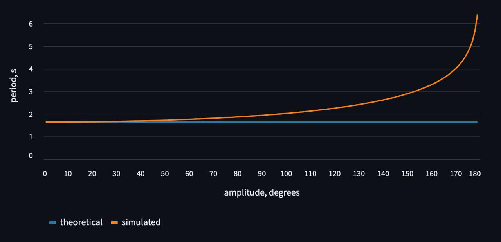
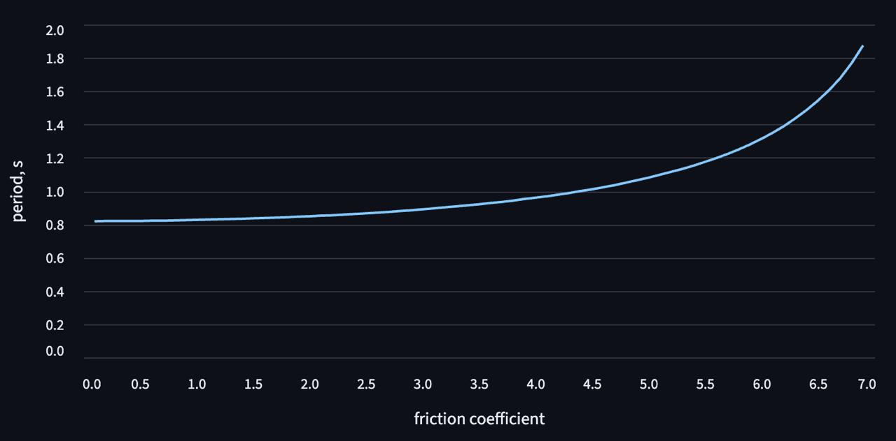

# М5. Физический маятник

## Задача

Смоделировать свободные колебания физического маятника с трением и без.
В качестве маятника используем подвешенный за один конец стержень.

## Исследования

### Зависимость периода колебания от амлитуды

### Зависимость периода от коеффициента трения

Из прошлого опыта понятно, что при гармонических колебаниях, даже при уменьшении амплитуды, можно считать период фиксированным на протяжении всего колебательного процесса.  
Так что этот опыт будем проводить в пределах 3-5 градусов, чтобы избежать погрешности.

Также не будем расчитывать значения коеффициента трения более 7, так как маятник не успевает сделать даже одного колебания (затухает мгновенно).

## Входные параметры

### Параметры маятника

- **Вес (0.1–100 кг)**: Нижний предел 0.1 кг соответствует минимально реалистичной массе стержня для модели физического маятника. Значения менее 0.1 кг физически нереалистичны и могут привести к проблемам с численной точностью из-за малого момента инерции. Верхний предел 100 кг выбран для соответствия типичным экспериментальным условиям (в том числе для реалистичности в купе с длиной) и предотвращения чрезмерно больших значений энергии, что может влиять на устойчивость численного интегрирования.

- **Длина (0.1–10 м)**: Поскольку теоретический период пропорционален √L, длина 0.1 м дает период ~0.3 с (требует меньший шаг интегрирования для точности), а длина 10 м — период ~5 с (требует больше времени симуляции для наблюдения нескольких колебаний). Диапазон покрывает как лабораторные масштабы (0.1–2 м), так и более крупные системы.

- **Угол (0–179°)**: Угол 0° исключает колебания (нет начальной потенциальной энергии). Верхний предел 179° соответствует максимальному отклонению от вертикали и физически достижимому начальному положению. Хотя теория малых колебаний точнее для углов <3~5°, модель работает корректно и для больших амплитуд, (т.к. мы не приближаем синус к его аргументу) что позволяет исследовать нелинейные эффекты.

### Параметры среды

- **Коэффициент трения (0–10)**: Значение 0 соответствует идеальным незатухающим колебаниям, что важно для сравнения с теоретическими расчетами. Значения >7 приводят к апериодическому затуханию (маятник не успевает совершить полное колебание), как отмечено в исследовании зависимости периода от трения. Верхний предел 10 позволяет исследовать предельные случаи затухания и границы применимости модели.

- **Время симуляции (0.2–20 с)**: Нижний предел 0.2 с выбран с учетом минимального периода колебаний (~0.3 с для L=0.1 м) и должен позволять наблюдать хотя бы часть цикла. Верхний предел 20 с обеспечивает наблюдение нескольких периодов для маятников разной длины при разумных вычислительных затратах и размере выходных данных. А для некоторых маятников амлитуда уменьшается настолько существенно, что позволяет продолжать симуляцию из-за предела вычислительной точности.

## Команда

- **Кирилл Цимбалюк**
  - вычисления
  - симуляция (код)
- **Владислав Секин**
  - описание, тех
  - исследование (графики)
  - тесты
- **Андрей Кругликов**
  - визуализация
  - кодстайл

## Запуск

### Простой путь

Достаточно просто зайти на [hsse-physics-labs.streamlit.app](https://hsse-physics-labs.streamlit.app) — там уже все развернуто!

### Локально

Инструкция в [корневом README](/README.md)

## [Тесты](/tests/swing_the_pendulum)
